# MediSense — Architecture & Design

> AI-powered health intelligence platform built on **Spring Boot 3.4 + Spring AI (Claude)** backend and a **React + Vite + TypeScript** frontend.

---

## 1. High-Level Overview

```
┌─────────────────────────────────────────────────────────────────────────────┐
│                          BROWSER  (React + Vite + TS)                       │
│                                                                              │
│  ┌──────────┐  ┌───────────────┐  ┌──────────────┐  ┌───────────────────┐  │
│  │Dashboard │  │ MediSummarize │  │  ClaimSense  │  │     MediChat      │  │
│  │  (home)  │  │  PDF → AI     │  │  Bill → AI   │  │  Conversational   │  │
│  └──────────┘  └───────────────┘  └──────────────┘  └───────────────────┘  │
│                              AppShell (layout + nav)                         │
└──────────────────────────────────┬──────────────────────────────────────────┘
                                   │  REST / JSON  (Vite proxy → :8080)
┌──────────────────────────────────▼──────────────────────────────────────────┐
│                       SPRING BOOT 3.4  BACKEND                               │
│                                                                              │
│  Controllers → Services → AI Agent Pipeline → Spring AI → Claude API        │
│                                                                              │
│  Persistence: PostgreSQL (Flyway V1–V8)                                     │
│  File storage: Local FS  or  AWS S3                                         │
└─────────────────────────────────────────────────────────────────────────────┘
                                   │
                    ┌──────────────┴──────────────┐
                    │     Anthropic Claude API      │
                    │  (claude-sonnet / opus via    │
                    │       Spring AI client)       │
                    └───────────────────────────────┘
```

---

## 2. Frontend Architecture

```
frontend/src/
├── main.tsx                   Entry point
├── App.tsx                    Root — login gate + top-level tab routing
│
├── pages/
│   ├── Login.tsx              Simple credential page (sets session)
│   └── Dashboard.tsx          Landing hero + feature cards + how-it-works
│
└── components/
    ├── AppShell.tsx           Layout shell
    │   ├── Green sidebar      Navigation tabs + recent MediSummarize analyses
    │   ├── Tab routing        dashboard | summarize | claimsense | medichat
    │   └── Session breadcrumb MediChat session picker
    │
    ├── MediSummarize.tsx      Upload PDF → GET /api/summarize
    │   ├── Language picker    8 Indian languages
    │   ├── Result panel       Structured summary
    │   └── Follow-up chat     POST /api/summarize/chat  (language-aware)
    │
    ├── ClaimSense.tsx         Multi-file claim checker
    │   ├── Policy dropdown    GET /api/claims/policies  (excludes MediShield)
    │   ├── Drop-zone upload   Multi-PDF drag & drop
    │   ├── Progress step-bar  Policy Fetched → Bill Classified → Cross-ref → Verdict
    │   ├── Verdict cards      CLAIMABLE / PARTIAL / EXCLUDED with line items
    │   └── Recent claims      GET /api/claims/recent  (sidebar, scrollable)
    │
    └── MediChat.tsx           Full conversational interface
        ├── Session list       Persistent sessions (stored in DB)
        ├── Message thread     Bubbles: text | summary | verdict cards
        ├── File attachment    Hospital bill or medical report
        └── Language picker    Responses translated per-turn
```

---

## 3. Backend Architecture

### 3a. REST Controllers

| Controller | Route | Purpose |
|---|---|---|
| `HealthController` | `GET /api/health` | Liveness probe |
| `MediSummarizeController` | `POST /api/summarize` | Summarize a medical PDF |
| `MediSummarizeChatController` | `POST /api/summarize/chat` | Follow-up chat on a summary |
| `ClaimSenseController` | `POST /api/claims/analyze` | Analyze bill(s) against a policy |
| `ClaimSenseController` | `GET /api/claims/policies` | List available policies |
| `ClaimSenseController` | `GET /api/claims/recent` | Last N claim results |
| `RecentAnalysisController` | `GET /api/recent` | Last N summarize results |
| `ChatController` | `POST /api/chat/{sessionId}` | MediChat turn (multipart) |
| `MediChatController` | `POST /api/medichat` | Alternate MediChat endpoint |

---

### 3b. Feature: MediSummarize

```
POST /api/summarize  (multipart PDF + language)
        │
        ▼
MediSummarizeService
  ├── PdfTextExtractor          Extract raw text from PDF bytes (PDFBox)
  ├── DocumentValidationAgent   Claude: is this a medical document?
  ├── StorageService            Persist file (local or S3)
  ├── ExtractionAgent           Claude: raw text → structured JSON
  ├── SummarizationAgent        Claude: JSON → plain-language summary
  ├── TranslationAgent          Claude: translate to selected language
  └── SummarizeResultRepository Save to DB (summarize_results table)
        │
        ▼
  MediSummarizeResponse { extractedJson, summary }

POST /api/summarize/chat  (message + extractedJson + language)
        │
        ▼
MediSummarizeChatController
  ├── MediChatAgent             Claude: answer follow-up question on JSON context
  └── TranslationAgent          Claude: translate reply to selected language
```

---

### 3c. Feature: ClaimSense (4-Agent Pipeline)

```
POST /api/claims/analyze  (policyId + userName + language + PDF bills[])
        │
        ▼
ClaimSenseService  [loops per uploaded bill]
  │
  ├── Step 1 │ PdfTextExtractor           raw text from PDF
  ├── Step 2 │ BillAnalysisAgent          Claude: raw text → bill JSON
  │           │                             { patient_name, line_items[], total }
  ├── Step 3 │ DocumentValidationAgent    Claude: is this a real bill?
  ├── Step 4 │ [guard] invalid doc        → EXCLUDED verdict, skip
  ├── Step 5 │ [guard] patient mismatch   → EXCLUDED verdict, skip
  ├── Step 6 │ StorageService             persist PDF file
  ├── Step 7 │ PolicyRuleRepository       fetch policy JSONB rules from DB
  ├── Step 8 │ ReasoningAgent             Claude: adjudicate bill vs policy rules
  │           │                             → verdict JSON { overall_verdict,
  │           │                               claimable_amount, line_items[] }
  ├── Step 9 │ ExplanationAgent           Claude: verdict → patient explanation
  ├──Step 10 │ TranslationAgent           translate explanation
  ├──Step 11 │ ClaimResultRepository      persist to claim_results
  └──Step 12 │ build ClaimVerdict         return to frontend
```

---

### 3d. Feature: MediChat (Conversational State Machine)

```
POST /api/chat/{sessionId}  (message + optional PDF + language)
        │
        ▼
ChatController
        │
        ▼
MediChatOrchestrator  [state machine driven by ChatSessionState.awaiting]
        │
        ├── ConversationStateManager     get/create ChatSession + ChatSessionState
        │
        ├─ [IF file uploaded]
        │    ├── PdfTextExtractor        → rawText  (stored in state.rawText)
        │    ├── ExtractionAgent         → extractedJson (stored in state)
        │    ├── detectDocType()
        │    │
        │    ├─ [HOSPITAL_BILL / MIXED]
        │    │    └── if no insurer/tier → set awaiting=INSURER, ask user
        │    │        else              → runClaimPipeline()
        │    │
        │    └─ [MEDICAL_REPORT]
        │         ├── SummarizationAgent  → summary
        │         └── TranslationAgent    → translated summary
        │
        └─ [IF text message]
             │
             ├─ [awaiting=INSURER]
             │    ├── resolveInsurerId()
             │    ├── MediShield? → polite refusal, stay in INSURER state
             │    └── valid?      → set insurerId, awaiting=TIER, list valid tiers
             │
             ├─ [awaiting=TIER]
             │    ├── resolveTier()
             │    ├── validate against VALID_TIERS[insurerId]
             │    └── valid? → set tier, run claim pipeline if bill loaded
             │
             └─ [no awaiting state]
                  ├── GuardrailAgent      Claude: classify intent + health-related?
                  ├── not health-related  → canned "I'm a healthcare assistant" reply
                  ├── GREETING            → hello + prompt
                  ├── COVERAGE_QUESTION   → PolicyAgent + ExplanationAgent + Translation
                  └── GENERAL_HEALTH      → ExplanationAgent (real LLM answer)

─────────────────────────────────────────────────────────────────
Claim Pipeline (called from MediChat when insurer+tier are known)
─────────────────────────────────────────────────────────────────
runClaimPipeline() / runClaimPipelineFromJson()
  ├── PolicyAgent           fetch policy rules by policyId from DB
  ├── BillAnalysisAgent     analyze state.rawText → bill JSON
  ├── ReasoningAgent        adjudicate bill vs policy
  ├── ExplanationAgent      patient-facing explanation
  └── TranslationAgent      translate
```

**Insurer / Tier mappings (hardcoded in MediChatOrchestrator):**

| User says | Resolved insurer ID | Valid tiers |
|---|---|---|
| "star health" / "star" | `starhealth` | silver, gold |
| "hdfc ergo" / "hdfc" | `hdfcergo` | optima, myhealth |
| "niva bupa" / "niva" / "bupa" | `nivabupa` | reassure, companion |
| "medishield" | `medishield` | *(not supported — polite refusal)* |

---

## 4. AI Agents Catalogue

All agents use **Spring AI `ChatClient`** backed by Anthropic Claude.

| Agent | Location | Input | Output |
|---|---|---|---|
| `ExtractionAgent` | medisummarize/agents | raw PDF text | structured JSON (doc type, findings, medications…) |
| `SummarizationAgent` | medisummarize/agents | extracted JSON | plain-language summary |
| `MediChatAgent` | medisummarize/agents | user question + extracted JSON | follow-up answer |
| `DocumentValidationAgent` | shared | raw text + patient names | `ValidationResult` (isValid, patientMatch, reason) |
| `BillAnalysisAgent` | claimsense/agents | raw PDF text | bill JSON (patient_name, line_items, total) |
| `PolicyAgent` | claimsense/agents | policyId | formatted policy rules string (from DB) |
| `ReasoningAgent` | claimsense/agents | policy rules + bill JSON | verdict JSON (overall_verdict, claimable_amount, line_items[]) |
| `ExplanationAgent` | claimsense/agents | verdict JSON or context | patient-facing explanation text |
| `GuardrailAgent` | medichat | user message | `GuardrailResult` (isHealthRelated, intent, confidence) |
| `TranslationAgent` | medichat | text + language | translated text |

**GuardrailAgent intents:**
`GREETING` · `COVERAGE_QUESTION` · `POLICY_QUESTION` · `GENERAL_HEALTH` *(→ real LLM answer)*

**TranslationAgent languages:**
English · Hindi · Tamil · Telugu · Kannada · Malayalam · Bengali · Marathi

---

## 5. Database Schema (PostgreSQL + Flyway)

```
Flyway migrations: V1 → V8

┌──────────────────────────────────────────────────────────────────┐
│  policy_rules  (V1 + V2 + V5)                                    │
│  ─────────────────────────────                                   │
│  id BIGSERIAL PK                                                 │
│  policy_id VARCHAR UNIQUE   e.g. "starhealth-silver"             │
│  name VARCHAR                                                    │
│  rules_json JSONB           full policy rules blob               │
│  created_at TIMESTAMPTZ                                          │
│                                                                  │
│  Seeded policies (V5):                                           │
│    starhealth-silver, starhealth-gold                            │
│    hdfcergo-optima,   hdfcergo-myhealth                          │
│    nivabupa-reassure, nivabupa-companion                         │
└──────────────────────────────────────────────────────────────────┘

┌──────────────────────────────────────────────────────────────────┐
│  claim_results  (V1 + V6)                                        │
│  ─────────────────────────────                                   │
│  id, session_id, policy_id, file_name, local_path               │
│  patient_name_on_bill, verdict, confidence                       │
│  rule_applied, reason TEXT, raw_llm_output TEXT                  │
│  total_amount NUMERIC, claimable_amount NUMERIC  (V6)            │
│  line_items_json TEXT  (V6)                                      │
│  created_at TIMESTAMPTZ                                          │
└──────────────────────────────────────────────────────────────────┘

┌──────────────────────────────────────────────────────────────────┐
│  summarize_results  (V7)                                         │
│  ─────────────────────────────                                   │
│  id, file_name, local_path, summary TEXT                         │
│  created_at TIMESTAMPTZ                                          │
└──────────────────────────────────────────────────────────────────┘

┌──────────────────────────────────────────────────────────────────┐
│  chat_sessions  (V4)                                             │
│  ─────────────────────────────                                   │
│  id UUID PK, patient_name, language, created_at                  │
└──────────────────────────────────────────────────────────────────┘

┌──────────────────────────────────────────────────────────────────┐
│  chat_messages  (V4)                                             │
│  ─────────────────────────────                                   │
│  id BIGSERIAL, session_id UUID FK → chat_sessions               │
│  role (user/assistant), content TEXT                             │
│  content_type (text/summary/verdict), attached_file_name         │
│  created_at TIMESTAMPTZ                                          │
└──────────────────────────────────────────────────────────────────┘

┌──────────────────────────────────────────────────────────────────┐
│  chat_session_state  (V4 + V8)                                   │
│  ─────────────────────────────                                   │
│  session_id UUID PK                                              │
│  doc_type     MEDICAL_REPORT | HOSPITAL_BILL | MIXED | UNKNOWN   │
│  extracted_json TEXT   ExtractionAgent structured output         │
│  raw_text TEXT         raw PDF text (V8) — used by BillAnalysis  │
│  insurer_id   starhealth | hdfcergo | nivabupa                   │
│  policy_tier  silver | gold | optima | myhealth | …             │
│  awaiting     INSURER | TIER | null                              │
│  updated_at TIMESTAMPTZ                                          │
└──────────────────────────────────────────────────────────────────┘

┌──────────────────────────────────────────────────────────────────┐
│  mcp_tools  (V1 + V3)                                            │
│  ─────────────────────────────                                   │
│  id, tool_name UNIQUE, tool_type, description TEXT              │
│  endpoint_config JSONB, active BOOLEAN, created_at               │
└──────────────────────────────────────────────────────────────────┘
```

---

## 6. Full Component Interaction Diagram (Mermaid)

```mermaid
graph TB
    subgraph Browser["Frontend (React + Vite)"]
        APP[App.tsx]
        SHELL[AppShell]
        DASH[Dashboard]
        SUM[MediSummarize]
        CLAIM[ClaimSense]
        CHAT[MediChat]
        APP --> SHELL
        SHELL --> DASH & SUM & CLAIM & CHAT
    end

    subgraph Backend["Spring Boot 3.4 Backend"]
        subgraph Controllers
            HC[HealthController]
            MSC[MediSummarizeController]
            MSCC[MediSummarizeChatController]
            CSC[ClaimSenseController]
            RAC[RecentAnalysisController]
            CC[ChatController]
        end

        subgraph Services
            MSS[MediSummarizeService]
            CSS[ClaimSenseService]
            MCO[MediChatOrchestrator]
            CSM[ConversationStateManager]
        end

        subgraph SharedAgents["Shared AI Agents"]
            DVA[DocumentValidationAgent]
            TA[TranslationAgent]
            PDF[PdfTextExtractor]
            STORE[StorageService]
        end

        subgraph SumAgents["MediSummarize Agents"]
            EA[ExtractionAgent]
            SA[SummarizationAgent]
            MCA[MediChatAgent]
        end

        subgraph ClaimAgents["ClaimSense Agents"]
            BAA[BillAnalysisAgent]
            PA[PolicyAgent]
            RA[ReasoningAgent]
            EXA[ExplanationAgent]
        end

        subgraph ChatAgents["MediChat Agents"]
            GA[GuardrailAgent]
        end

        MSC --> MSS
        MSCC --> MCA & TA
        CSC --> CSS
        CC --> MCO
        MCO --> CSM
        MSS --> PDF & DVA & EA & SA & TA & STORE
        CSS --> PDF & DVA & BAA & PA & RA & EXA & TA & STORE
        MCO --> GA & EA & SA & BAA & PA & RA & EXA & TA
    end

    subgraph DB["PostgreSQL"]
        PR[(policy_rules)]
        CR[(claim_results)]
        SR[(summarize_results)]
        CS[(chat_sessions)]
        CM[(chat_messages)]
        CSS2[(chat_session_state)]
        MCP[(mcp_tools)]
    end

    subgraph External["External Services"]
        CLAUDE[Anthropic Claude API]
        S3[AWS S3 or Local FS]
    end

    SUM -->|POST /api/summarize| MSC
    SUM -->|POST /api/summarize/chat| MSCC
    CLAIM -->|POST /api/claims/analyze| CSC
    CLAIM -->|GET /api/claims/policies| CSC
    CLAIM -->|GET /api/claims/recent| CSC
    CHAT -->|POST /api/chat/:id| CC

    PA --> PR
    CSS --> CR
    MSS --> SR
    CSM --> CS & CM & CSS2

    EA & SA & MCA & DVA & BAA & RA & EXA & GA & TA -->|Spring AI| CLAUDE
    STORE --> S3
```



---

## 7. Data Flow: ClaimSense End-to-End

```
User selects policy + uploads bill PDF(s)
         │
         ▼
ClaimSense.tsx  →  POST /api/claims/analyze
                    { policyId, userName, language, bills[] }
         │
         ▼
ClaimSenseService (loops per file)
         │
    ┌────┴──────────────────────────────────────────────┐
    │  1. PDF bytes → PdfTextExtractor → rawText         │
    │  2. rawText → BillAnalysisAgent → billJson         │
    │     { patient_name, line_items, total_amount }     │
    │  3. rawText + names → DocumentValidationAgent      │
    │     → ValidationResult { isValid, patientMatch }   │
    │  4. Guard: invalid or mismatch → EXCLUDED verdict  │
    │  5. StorageService.store(file)                     │
    │  6. PolicyRuleRepository.findByPolicyId()          │
    │     → policyRulesJson (JSONB)                      │
    │  7. ReasoningAgent.reason(rules, billJson)         │
    │     → verdictJson { overall_verdict,               │
    │                     claimable_amount,              │
    │                     line_items[verdict, reason] }  │
    │  8. ExplanationAgent.explain(verdictJson)          │
    │     → explanation (English)                        │
    │  9. TranslationAgent.translate(explanation, lang)  │
    │ 10. ClaimResultRepository.save()                   │
    └────────────────────────────────────────────────────┘
         │
         ▼
ClaimVerdict[] → JSON response
         │
         ▼
ClaimSense.tsx renders verdict cards:
  ┌─────────────────────────────┐
  │ filename.pdf    [CLAIMABLE] │
  │ Total: ₹45,000              │
  │ Claimable: ₹38,000  95%    │
  │ Rule: hospitalization-cover │
  │ "Your hospitalization…"     │
  │ ┌──────────────────────┐   │
  │ │ Line items table     │   │
  │ └──────────────────────┘   │
  │ ✓ This bill is covered     │
  └─────────────────────────────┘
```

---

## 8. Data Flow: MediChat Conversation

```
State machine driven by ChatSessionState.awaiting field

TURN 1: User uploads hospital bill PDF
  → PdfTextExtractor → rawText (stored in state.rawText)
  → ExtractionAgent → extractedJson
  → detectDocType() → HOSPITAL_BILL
  → state.awaiting = "INSURER"
  → Bot: "Which insurance company are you with?"

TURN 2: User types "Star Health"
  → resolveInsurerId("star health") → "starhealth"
  → state.insurerId = "starhealth", state.awaiting = "TIER"
  → Bot: "Which tier? (Silver, Gold)"

TURN 3: User types "Gold"
  → resolveTier("gold") → "gold"
  → validate: VALID_TIERS["starhealth"] contains "gold" ✓
  → state.policyTier = "gold", state.awaiting = null
  → runClaimPipelineFromJson():
      PolicyAgent → starhealth-gold rules
      BillAnalysisAgent(rawText) → bill JSON
      ReasoningAgent → verdict JSON
      ExplanationAgent → explanation
      TranslationAgent → translated
  → Bot: ClaimVerdict card in thread

TURN 4 (anytime): "What is diabetes?"
  → GuardrailAgent → { isHealthRelated: true, intent: "GENERAL_HEALTH" }
  → ExplanationAgent.explain("Answer: What is diabetes?")
  → TranslationAgent → translated answer
  → Bot: real informative response

TURN 4 (anytime): "What's the weather?"
  → GuardrailAgent → { isHealthRelated: false }
  → Bot: "I'm MediSense, a healthcare assistant…"
```

---

## 9. Tech Stack Summary

| Layer | Technology |
|---|---|
| Frontend framework | React 18 + Vite + TypeScript |
| Styling | CSS Modules (no Tailwind) |
| Backend framework | Spring Boot 3.4.x |
| AI orchestration | Spring AI 1.0.x |
| LLM | Anthropic Claude (Sonnet/Opus) |
| PDF parsing | Apache PDFBox (via PdfTextExtractor) |
| Database | PostgreSQL |
| Migrations | Flyway (V1–V8) |
| ORM | Spring Data JPA / Hibernate |
| File storage | Local FS (dev) / AWS S3 (prod) |
| Containerization | Docker Compose |
| Build tool | Maven (backend) + Vite (frontend) |
